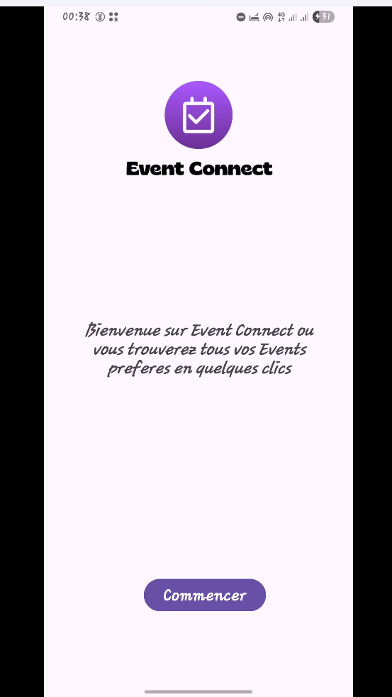
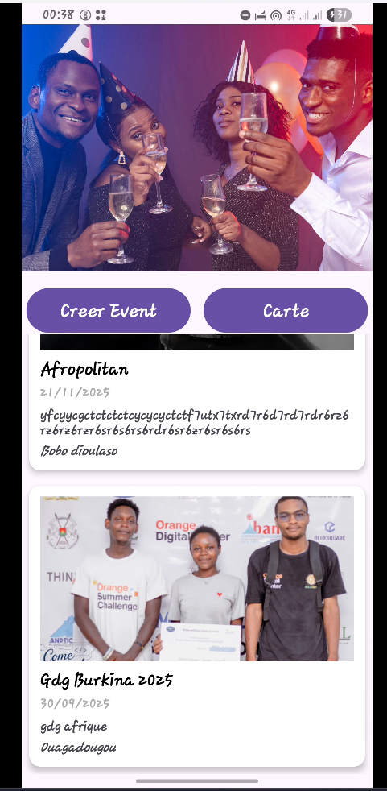
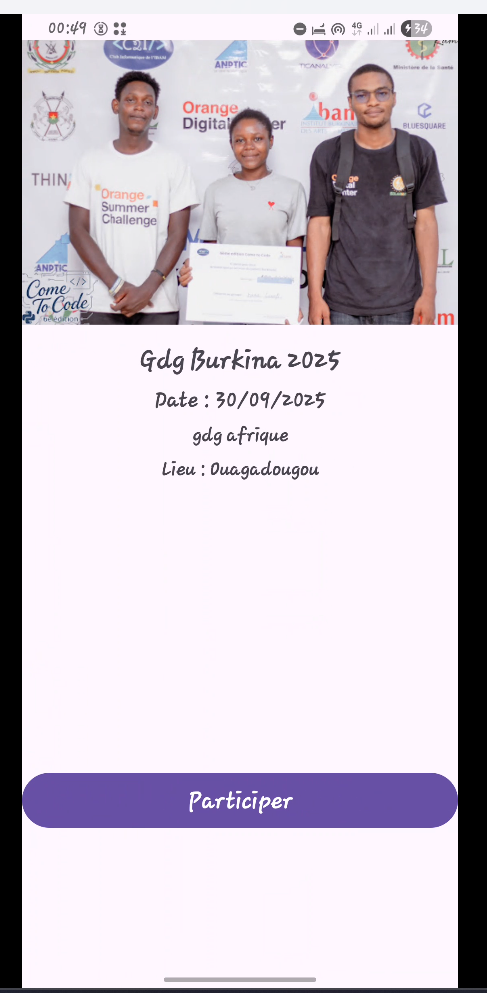
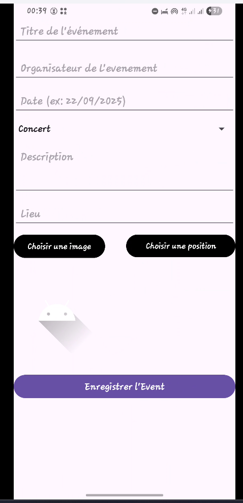
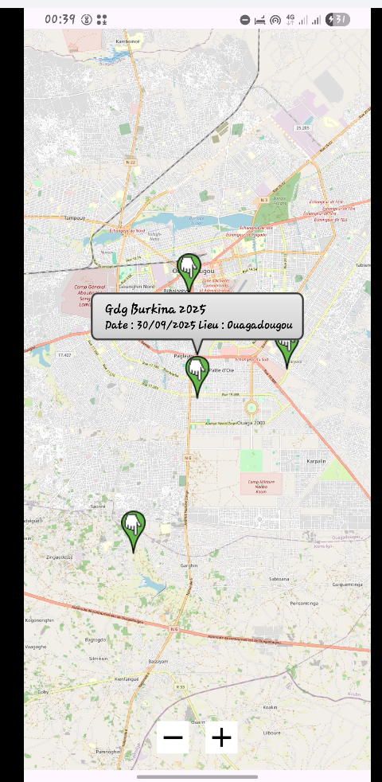

# Application de Gestion d'Événements: EventCOnnect

Cette application mobile permet aux utilisateurs de créer, consulter et localiser des événements sur une carte interactive. 

---

## Captures








---

## Fonctionnalites Principales
- Création et enregistrement d’événements (titre, date, lieu, description, etc.).

- Visualisation des événements sous forme de liste.

- Affichage des événements sur une carte avec des marqueurs.

- Localisation en temps réel de l’utilisateur avec un marqueur rouge.

- Gestion des permissions Android pour la localisation.
---

## 📂 Structure du projet

```
EventConnect
├─ .idea
│  ├─ compiler.xml
│  ├─ deploymentTargetSelector.xml
│  ├─ gradle.xml
│  ├─ migrations.xml
│  ├─ misc.xml
│  ├─ other.xml
│  └─ vcs.xml
├─ afficher les events sur la carte.png
├─ app
│  ├─ proguard-rules.pro
│  ├─ release
│  │  ├─ app-release.apk
│  │  ├─ baselineProfiles
│  │  │  ├─ 0
│  │  │  │  └─ app-release.dm
│  │  │  └─ 1
│  │  │     └─ app-release.dm
│  │  └─ output-metadata.json
│  └─ src
│     ├─ androidTest
│     │  └─ java
│     │     └─ bf
│     │        └─ uv
│     │           └─ eventconnect
│     │              └─ ExampleInstrumentedTest.java
│     ├─ main
│     │  ├─ AndroidManifest.xml
│     │  ├─ java
│     │  │  └─ bf
│     │  │     └─ uv
│     │  │        └─ eventconnect
│     │  │           ├─ AddActivity.java
│     │  │           ├─ AppDatabase.java
│     │  │           ├─ CarteActivity.java
│     │  │           ├─ DbProvider.java
│     │  │           ├─ DetailActivity.java
│     │  │           ├─ Event.java
│     │  │           ├─ EventAdapter.java
│     │  │           ├─ EventDao.java
│     │  │           ├─ EventModel.java
│     │  │           ├─ GetMapsActivity.java
│     │  │           ├─ MainActivity.java
│     │  │           └─ SecondActivity.java
│     │  └─ res
│     │     ├─ drawable
│     │     │  ├─ ic_launcher_background.xml
│     │     │  └─ ic_launcher_foreground.xml
│     │     ├─ drawable-nodpi
│     │     │  ├─ bg1.jpg
│     │     │  ├─ bg2.jpg
│     │     │  └─ logo.png
│     │     ├─ layout
│     │     │  ├─ activity_add.xml
│     │     │  ├─ activity_carte.xml
│     │     │  ├─ activity_detail.xml
│     │     │  ├─ activity_getmaps.xml
│     │     │  ├─ activity_main.xml
│     │     │  ├─ activity_second.xml
│     │     │  └─ item_event.xml
│     │     ├─ mipmap-anydpi
│     │     │  ├─ ic_launcher.xml
│     │     │  └─ ic_launcher_round.xml
│     │     ├─ mipmap-hdpi
│     │     │  ├─ ic_launcher.webp
│     │     │  └─ ic_launcher_round.webp
│     │     ├─ mipmap-mdpi
│     │     │  ├─ ic_launcher.webp
│     │     │  └─ ic_launcher_round.webp
│     │     ├─ mipmap-xhdpi
│     │     │  ├─ ic_launcher.webp
│     │     │  └─ ic_launcher_round.webp
│     │     ├─ mipmap-xxhdpi
│     │     │  ├─ ic_launcher.webp
│     │     │  └─ ic_launcher_round.webp
│     │     ├─ mipmap-xxxhdpi
│     │     │  ├─ ic_launcher.webp
│     │     │  └─ ic_launcher_round.webp
│     │     ├─ values
│     │     │  ├─ colors.xml
│     │     │  ├─ strings.xml
│     │     │  └─ themes.xml
│     │     ├─ values-night
│     │     │  └─ themes.xml
│     │     └─ xml
│     │        ├─ backup_rules.xml
│     │        ├─ data_extraction_rules.xml
│     │        └─ file_paths.xml
│     └─ test
│        └─ java
│           └─ bf
│              └─ uv
│                 └─ eventconnect
│                    └─ ExampleUnitTest.java
├─ creer un evenement.png
├─ detail page.png
├─ EventConnect.pdf
├─ gradle
│  ├─ libs.versions.toml
│  └─ wrapper
│     ├─ gradle-wrapper.jar
│     └─ gradle-wrapper.properties
├─ gradle.properties
├─ gradlew
├─ gradlew.bat
├─ landing.png
├─ page daccueil.png
└─ README.md

```
